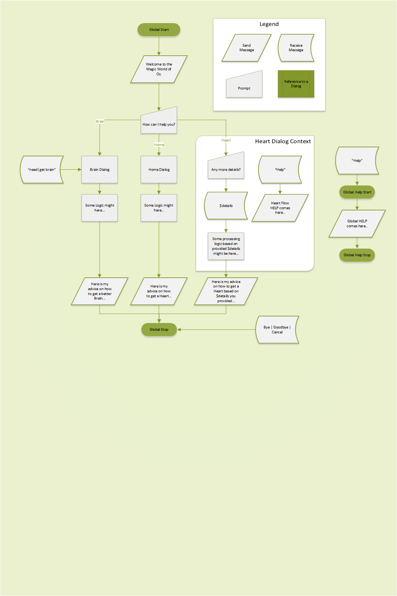

# oz-chatbot
A sample chat-bot aimed to demonstrate how to build a configurable bot based on a relatively low-level sdk (ms bot framework in this case)

## Build
```
npm install
```

## Run
```
node app.js
```

## Try
Install https://docs.microsoft.com/en-us/bot-framework/debug-bots-emulator and give it a try.

### Sample conversation flow illustration

